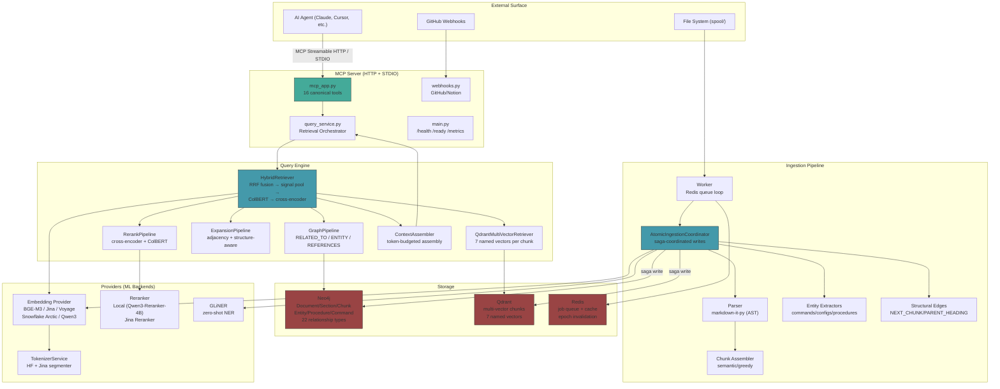
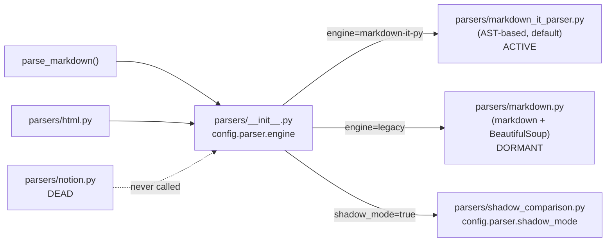
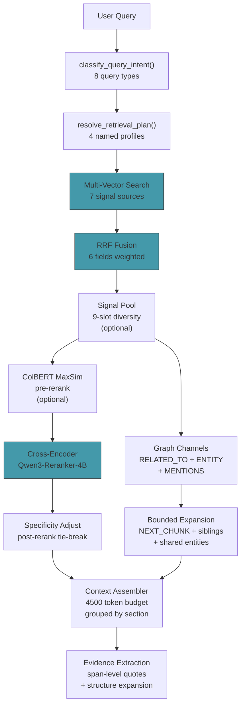
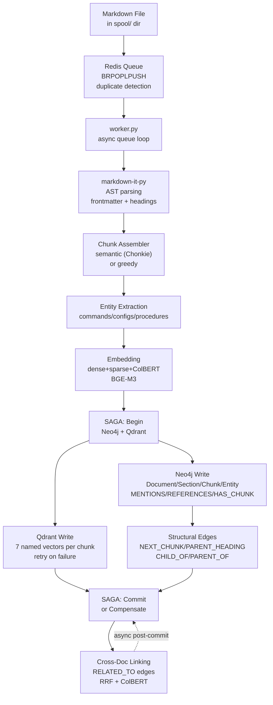
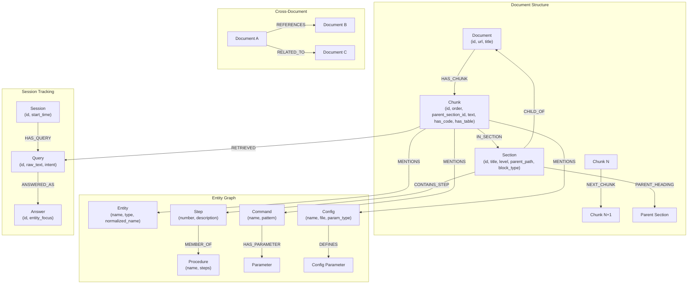

# WekaDocs Matrix — System Architecture

> GraphRAG pipeline for Weka product documentation
> Multi-vector hybrid search + Neo4j knowledge graph + MCP API server

---

## System Overview



---

## Parser Routing (2 Parsers, 1 Router)



---

## Retrieval Architecture (Active Path)



---

## Ingestion Pipeline (Active Path)



---

## MCP Tool Architecture

```
┌─────────────────────────────────────────────────────────────┐
│  mcp_app.py — build_mcp_server() → mcp.server.Server       │
│                                                             │
│  3 tool profiles (MCP_TOOL_PROFILE env):                    │
│  ├── production (default): kb.retrieve_evidence,            │
│  │                         kb.read_excerpt,                │
│  │                         graph.expand                     │
│  ├── analyst: all 16 canonical tools                       │
│  └── full: no filtering                                    │
│                                                             │
│  CANONICAL TOOLS (16):                                     │
│  ┌───────────────────────────────────────────────────────┐ │
│  │ kb.search         — Hybrid search + dedup + scratch   │ │
│  │ kb.read_excerpt    — Scratch retrieval                │ │
│  │ kb.expand_excerpt  — Structural neighbor expansion     │ │
│  │ kb.extract_evidence — Span-level quotes                │ │
│  │ kb.retrieve_evidence — Full evidence pack pipeline     │ │
│  │ kb.search_sections — Section-level search (light)      │ │
│  │ kb.get_section_text — Section text fetch               │ │
│  ├───────────────────────────────────────────────────────┤ │
│  │ graph.describe    — Node description                  │ │
│  │ graph.expand      — Neighbor expansion                │ │
│  │ graph.paths       — Inter-node paths                  │ │
│  │ graph.parents     — Parent nodes                      │ │
│  │ graph.children    — Child nodes                       │ │
│  │ graph.entities_for_sections — Entity lookup            │ │
│  │ graph.sections_for_entities — Reverse entity lookup    │ │
│  │ graph.traverse    — Relationship traversal             │ │
│  │ graph.summarize   — Neighborhood summary               │ │
│  │ graph.context_bundle — Graph+text context bundle       │ │
│  └───────────────────────────────────────────────────────┘ │
│                                                             │
│  LEGACY ALIASES (16, deprecated):                           │
│  kb_search → kb.search    search_documentation (v1)         │
│  graph_describe → graph.describe  etc.                      │
│                                                             │
│  TRANSPORTS:                                                │
│  ├── HTTP Streamable: main.py → /_mcp (MCP SDK SessionMgr) │
│  ├── HTTP Legacy REST: main.py → /mcp/* (gated)            │
│  └── STDIO: stdio_server.py → Claude Desktop direct          │
└─────────────────────────────────────────────────────────────┘
```

---

## Data Model (Neo4j Graph Schema)



---

## 22 Relationship Types (from `neo/schema.py`)

```
ANSWERED_AS    CHILD_OF        CONTAINS_STEP   DEFINES
EXECUTES       FOCUSED_ON      HAS_CITATION     HAS_PARAMETER
HAS_QUERY      HAS_CHUNK       IN_CHUNK         IN_SECTION
MENTIONED_IN   MENTIONS        NEXT             NEXT_CHUNK
PARENT_HEADING PARENT_OF       REFERENCES       RELATED_TO
RESOLVES       RETRIEVED       SUPPORTED_BY
```

---

## Feature Flags & Configuration Knobs

### Retrieval Profile System (4 profiles replace 18+ individual flags)

| Profile | dense | sparse | colbert | signal_pool | graph | expansion | focused_rerank |
|---------|-------|--------|---------|-------------|-------|-----------|----------------|
| `vector_only` | ✓ | — | ✓ | — | — | — | — |
| `precision_vector` | ✓ | ✓ | ✓ | ✓ | — | ✓ | ✓ |
| `graph_assisted` | ✓ | ✓ | ✓ | ✓ | ✓ | ✓ | ✓ |
| `graph_full` | ✓ | ✓ | ✓ | ✓ | ✓ | ✓ | ✓ |

### Key Toggle Points

| Category | Count | Examples |
|----------|-------|----------|
| Embedding providers | 6 | BGE-M3 (default), Jina, Voyage, Arctic, Qwen3, ST |
| Rerank providers | 3 | Local (Qwen3-Reranker-4B), Jina, Noop |
| Chunk assemblers | 3 | Greedy (default), Semantic (Chonkie), Structured |
| Markdown parsers | 2 | markdown-it-py (default), legacy markdown |
| Retrieval engines | 2 | HybridRetriever (active), HybridSearchEngine (legacy) |
| Sparse vector types | 4 | text-sparse, title-sparse, entity-sparse, doc_title-sparse |
| Ingestion watchers | 3 | FileSystem, S3 (stub), HTTP |
| MCP transports | 3 | HTTP Streamable, HTTP Legacy REST, STDIO |
| MCP tool profiles | 3 | production (3 tools), analyst (16), full (unfiltered) |

### Environment Variable Knobs: ~85 total
- ~15 in mcp_server (MCP_TOOL_PROFILE, MCP_EVIDENCE_*, MCP_SCRATCH_*)
- ~15 in providers (EMBEDDINGS_PROVIDER, BGE_M3_*, QWEN3_*, CHONKIE_*)
- ~12 in tokenizer (TOKENIZER_BACKEND, HF_*, TRANSFORMERS_*)
- ~8 in reranker (RERANKER_*)
- ~20 in ingestion (INGEST_WATCH_*, EMBED_*, SPARSE_*)
- ~15 in retrieval (hybrid.*, expansion.*, signal_pool.*, cache.*)

---

## Docker Architecture

```
┌──────────────────────────────────────────────────────┐
│  docker-compose (implied)                             │
│                                                       │
│  ┌─────────────────────┐  ┌──────────────────────┐  │
│  │ mcp-server           │  │ ingestion-service     │  │
│  │ (FastAPI:8000,       │  │ (FastAPI:9108,        │  │
│  │  MCP Streamable HTTP)│  │  file watcher)         │  │
│  │ → query_service      │  │ → auto/service.py      │  │
│  └─────────────────────┘  └──────────────────────┘  │
│                                                       │
│  ┌─────────────────────┐  ┌──────────────────────┐  │
│  │ ingestion-worker     │  │ mxbai-reranker        │  │
│  │ (Redis queue loop)   │  │ (Qwen3-Reranker-4B    │  │
│  │ → worker.py          │  │  HTTP service)         │  │
│  └─────────────────────┘  └──────────────────────┘  │
│                                                       │
│  ┌──────────┐ ┌────────────┐ ┌──────────────────┐   │
│  │ Neo4j    │ │ Qdrant     │ │ Redis             │   │
│  │ (graph)  │ │ (vectors)  │ │ (queue + cache)    │   │
│  └──────────┘ └────────────┘ └──────────────────┘   │
└──────────────────────────────────────────────────────┘
```

---

## Key Architectural Patterns

### 1. Saga-Coordinated Dual Write
`AtomicIngestionCoordinator` writes to both Neo4j and Qdrant within a logical saga. If either write fails, the other is compensated (Qdrant points deleted, Neo4j transaction rolled back).

### 2. Multi-Vector Qdrant Strategy
Each chunk has 7 named vectors in a single Qdrant collection:
- **content** (dense, 1024d) — BGE-M3 semantic
- **title** (dense, 1024d) — section heading vector
- **text-sparse** (SPLADE, 250002d) — lexical matching
- **title-sparse** (SPLADE, 250002d) — heading lexical
- **entity-sparse** (SPLADE, 250002d) — entity lexical
- **doc_title-sparse** (SPLADE, 250002d) — document-level lexical
- **colbert** (multi-vector) — late-interaction

### 3. RRF Fusion with Per-Field Weights
Multi-vector results are fused via Reciprocal Rank Fusion with configurable field weights. Content=1.2, text-sparse=2.0 (SPLADE prioritized for domain terms), rest at 0.3-0.5.

### 4. Evidence Extraction Pipeline
`kb.retrieve_evidence`: Search → dedup → signal pool → ColBERT → cross-encoder → graph expansion → span-level evidence extraction → score blending (70% retrieval / 30% lexical overlap).

### 5. Epoch-Based Cache Invalidation
Redis stores document-level and chunk-level epoch counters. Cache keys include epoch versions for O(1) invalidation.

---

## Dependency Map (Production Import Chain)

```
main.py / stdio_server.py
  └── mcp_app.py
        ├── query_service.py
        │     ├── HybridRetriever (hybrid_retrieval.py)
        │     │     ├── QdrantMultiVectorRetriever (vector_backends.py)
        │     │     │     └── EmbeddingProvider (provider factory)
        │     │     ├── classify_query_intent (query_intent.py)
        │     │     ├── rrf_fusion (fusion_pipeline.py)
        │     │     ├── bounded_expansion (expansion_pipeline.py)
        │     │     ├── get_reranker + colbert_rerank (rerank_pipeline.py)
        │     │     ├── graph_pipeline.py
        │     │     ├── signal_pool.py
        │     │     ├── resolve_retrieval_plan (retrieval_plan.py)
        │     │     └── ContextAssembler (context_assembly.py)
        │     └── SessionTracker (session_tracker.py)
        ├── GraphService (services/graph_service.py)
        │     ├── ContextBudgetManager
        │     └── SessionDeltaCache
        ├── TextService (services/text_service.py)
        ├── ContextAssemblerService (services/context_assembler.py)
        └── ScratchStore (scratch_store.py)

worker.py
  └── AtomicIngestionCoordinator (atomic.py)
        ├── parse_markdown (ingestion/parsers)
        ├── chunk_assembler / semantic_chunker
        ├── extract_entities (extract/)
        ├── compute_embeddings (providers)
        ├── build_structural_edges (structural_edges.py)
        └── cross_doc_linking (services/cross_doc_linking.py)

Everything: shared/config.py, shared/connections.py, shared/observability/*
```
