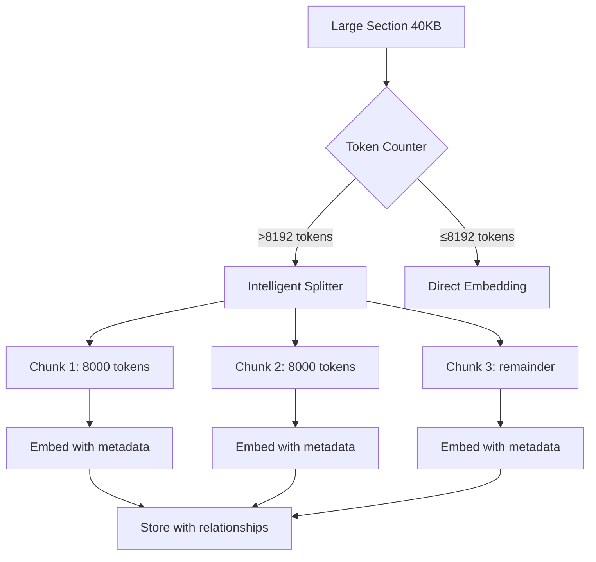

# Production Fix: Content Preservation and Token Management

**Date:** 2025-01-27
**Status:** Planning
**Criticality:** PRODUCTION BLOCKER
**Estimated Implementation:** 4-6 hours

---

## Executive Summary

Current implementation **permanently loses content** by truncating large sections to fit token limits. This is **unacceptable** for production. This plan provides a comprehensive solution that:

1. **Preserves 100% of content** through intelligent section splitting
2. **Accurately counts tokens** using tiktoken (no more estimation failures)
3. **Maintains retrieval accuracy** through chunk relationships and metadata
4. **Works within existing schema** with minimal extensions
5. **Provides production stability** until intelligent chunking v2 is ready

**Key Principle:** Every character of source content MUST be preserved and retrievable.

---

## Problem Analysis

### Current State (UNACCEPTABLE)

```python
# Current broken logic:
if text_len > max_chars:
    text = text[:max_chars]  # ❌ THROWS AWAY DATA
    text_len = max_chars
```

**Example Data Loss:**
- Section with 41,246 chars → Truncated to 20,480 chars
- **20,766 chars (50.4%) PERMANENTLY LOST**
- Critical information missing from knowledge base
- Retrieval quality severely degraded

### Root Causes

1. **Character-Based Token Estimation**
   - Assumes 2.5 chars/token (now failing)
   - Technical docs average 1.5-2.0 chars/token
   - Dense reference tables: ~1.2 chars/token
   - No way to know without actual tokenization

2. **Truncation Instead of Splitting**
   - Simple truncation loses semantic coherence
   - No attempt to preserve complete information
   - No relationship tracking between split parts

3. **Section-Level Granularity Too Coarse**
   - Some sections are 40KB+ (massive reference tables)
   - Others are <1KB (simple descriptions)
   - One-size-fits-all approach fails

---

## Proposed Solution Architecture

### High-Level Strategy



### Component Design

#### 1. Token Counter (tiktoken WAS WRONG - USE EXACT TOKENIZER FOR JINA-EMBEDDINGS-v3 from the XLM-RoBERTa family)

```python
from transformers import AutoTokenizer
import hashlib
import os

class TokenCounter:
    def __init__(self):
        # CRITICAL: Use the EXACT tokenizer for jina-embeddings-v3 (XLM-RoBERTa family)
        # NOT cl100k_base (OpenAI) - that was wrong!
        self.backend = os.getenv('TOKENIZER_BACKEND', 'hf')  # 'hf' or 'segmenter'

        if self.backend == 'hf':
            # Primary: HuggingFace tokenizer (local, fast, exact)
            self.tokenizer = AutoTokenizer.from_pretrained(
                os.getenv('HF_TOKENIZER_ID', 'jinaai/jina-embeddings-v3'),
                cache_dir=os.getenv('HF_CACHE', '/opt/hf-cache')
            )
        else:
            # Secondary: Jina Segmenter API (network, free, exact)
            self.segmenter_url = os.getenv('JINA_SEGMENTER_BASE_URL', 'https://api.jina.ai/v1/segment')
            self.api_key = os.getenv('JINA_API_KEY')  # Optional, improves rate limits

        self.max_tokens = 8192
        self.target_tokens = 7900  # More conservative buffer

    def count_tokens(self, text: str) -> int:
        """Actual token count using model-specific tokenizer."""
        if self.backend == 'hf':
            return len(self.tokenizer.encode(text, add_special_tokens=False))
        else:
            # Call Jina Segmenter API
            return self._count_via_segmenter(text)

    def needs_splitting(self, text: str) -> bool:
        """Check if text exceeds token limit."""
        return self.count_tokens(text) > self.max_tokens

    def truncate_to_token_limit(self, text: str, max_tokens: int) -> str:
        """Truncate text to exact token count."""
        if self.backend == 'hf':
            tokens = self.tokenizer.encode(text, add_special_tokens=False)
            if len(tokens) <= max_tokens:
                return text
            truncated_tokens = tokens[:max_tokens]
            return self.tokenizer.decode(truncated_tokens, skip_special_tokens=True)
        else:
            # Use segmenter for truncation guidance
            return self._truncate_via_segmenter(text, max_tokens)

    def compute_integrity_hash(self, text: str) -> str:
        """Compute SHA256 for integrity verification."""
        return hashlib.sha256(text.encode('utf-8')).hexdigest()
```

#### 2. Intelligent Section Splitter

```python
class IntelligentSplitter:
    def __init__(self, token_counter: TokenCounter):
        self.token_counter = token_counter
        self.target_tokens = 8000  # Leave buffer for safety
        self.min_tokens = 1000     # Don't create tiny chunks
        self.overlap_tokens = 200  # Context preservation

    def split_section(self, section_text: str, id: str) -> List[Dict]:
        """
        Split large section into chunks while preserving meaning.

        Returns list of chunks with metadata:
        [
            {
                'text': str,
                'order': int,
                'total_chunks': int,
                'parent_section_id': str,
                'overlap_start': bool,
                'overlap_end': bool,
                'token_count': int
            }
        ]
        """
        if not self.token_counter.needs_splitting(section_text):
            return [{
                'text': section_text,
                'order': 0,
                'total_chunks': 1,
                'parent_section_id': id,
                'overlap_start': False,
                'overlap_end': False,
                'token_count': self.token_counter.count_tokens(section_text)
            }]

        # Split strategy (in priority order):
        # 1. Try paragraph boundaries (double newline)
        # 2. Try sentence boundaries (. ! ?)
        # 3. Try line boundaries (single newline)
        # 4. Last resort: word boundaries

        chunks = self._split_with_overlap(section_text, id)
        return chunks

    def _split_with_overlap(self, text: str, id: str) -> List[Dict]:
        """
        Split text into chunks with overlapping context.

        Key features:
        - Each chunk ≤ 8000 tokens (safe margin)
        - 200-token overlap between chunks for context
        - Splits at semantic boundaries when possible
        - Maintains chunk order and relationships
        """
        # Implementation details...
```

#### 3. Schema Extensions for Chunk Management

**Neo4j Schema Addition:**

```cypher
// New properties for Section nodes
ALTER Section ADD PROPERTIES:
  - is_chunked: BOOLEAN (default false)
  - order: INTEGER (0 if not chunked)
  - total_chunks: INTEGER (1 if not chunked)
  - parent_section_id: STRING (self-reference if not chunked)
  - chunk_boundaries: STRING (JSON: {start_char: int, end_char: int})

// New relationship for chunk sequencing
CREATE RELATIONSHIP:
  (:Section)-[:NEXT_CHUNK]->(:Section)

// New index for chunk queries
CREATE INDEX section_chunk_idx FOR (s:Section) ON (s.parent_section_id, s.order)
```

**Qdrant Metadata Enhancement:**

```python
{
    "node_id": "hash_of_chunk",
    "id": "original_section_hash",
    "document_uri": "file://...",
    "chunk_metadata": {
        "is_chunked": true,
        "order": 1,
        "total_chunks": 3,
        "parent_section_id": "original_section_hash",
        "has_prev": true,
        "has_next": true,
        "overlap_tokens": 200
    }
}
```

#### 4. Retrieval Strategy Adjustments

**Query Processing:**

```python
def retrieve_with_chunk_awareness(query_vector, top_k=10):
    """
    Retrieve sections with chunk-awareness.

    Strategy:
    1. Find top matching chunks
    2. Aggregate scores by parent_section_id
    3. Include adjacent chunks for context
    4. Deduplicate and rerank
    """
    # Get initial matches
    matches = qdrant.search(query_vector, limit=top_k * 2)

    # Group by parent section
    section_groups = {}
    for match in matches:
        parent_id = match.metadata.get('parent_section_id', match.id)
        if parent_id not in section_groups:
            section_groups[parent_id] = []
        section_groups[parent_id].append(match)

    # For each section, get all chunks if chunked
    complete_sections = []
    for id, chunks in section_groups.items():
        if chunks[0].metadata.get('is_chunked', False):
            # Fetch all chunks of this section
            all_chunks = fetch_all_chunks(id)
            complete_sections.append({
                'id': id,
                'chunks': all_chunks,
                'best_score': max(c.score for c in chunks),
                'coverage': len(chunks) / all_chunks[0].metadata['total_chunks']
            })
        else:
            complete_sections.append({
                'id': id,
                'chunks': chunks,
                'best_score': chunks[0].score,
                'coverage': 1.0
            })

    # Rerank by combination of score and coverage
    return rerank_sections(complete_sections, top_k)
```

---

## Implementation Plan

### Phase 1: Token Counter Integration (1 hour)

**Files to Modify:**
- `src/providers/embeddings/jina.py`
- `requirements.txt` (add proper dependencies)
- `Dockerfile` (add tokenizer prefetch)

**Dependencies to Add:**
```txt
transformers>=4.43  # For HuggingFace tokenizer
tokenizers>=0.15   # Rust backend, very fast
sentencepiece>=0.2.0  # XLM-RoBERTa uses SentencePiece
huggingface_hub>=0.23  # For prefetching at build time
```

**Docker Prefetch (add to Dockerfile):**
```dockerfile
# Prefetch tokenizer during build to avoid runtime download
ENV HF_HOME=/opt/hf-cache
RUN python -c "from transformers import AutoTokenizer; AutoTokenizer.from_pretrained('jinaai/jina-embeddings-v3')"
```

**Environment Variables:**
```bash
# Tokenizer backend selection
TOKENIZER_BACKEND=hf  # 'hf' for HuggingFace local, 'segmenter' for Jina API

# HuggingFace options (when TOKENIZER_BACKEND=hf)
HF_TOKENIZER_ID=jinaai/jina-embeddings-v3
HF_CACHE=/opt/hf-cache
TRANSFORMERS_OFFLINE=true  # Prevent runtime downloads

# Jina Segmenter options (when TOKENIZER_BACKEND=segmenter)
JINA_SEGMENTER_BASE_URL=https://api.jina.ai/v1/segment
# JINA_API_KEY already exists
SEGMENTER_TOKENIZER_NAME=xlm-roberta-base
SEGMENTER_TIMEOUT_MS=3000

# Token limits
EMBED_MAX_TOKENS=8192
EMBED_TARGET_TOKENS=7900  # More conservative
EMBED_OVERLAP_TOKENS=200
SPLIT_MIN_TOKENS=1000

# Observability
LOG_SPLIT_DECISIONS=true
INTEGRITY_CHECK_SAMPLE_RATE=0.05
```

**Tasks:**
1. Add HuggingFace dependencies (NOT tiktoken - that was wrong)
2. Create dual-backend TokenCounter class with HF primary, Segmenter secondary
3. Add tokenizer prefetching to Docker build
4. Implement integrity verification with SHA256
5. Add comprehensive environment variable configuration

**Validation:**
- Unit test with XLM-RoBERTa tokenizer (NOT cl100k_base)
- Verify token counts match between HF local and Jina Segmenter
- SHA256 integrity check: original == reassembled chunks
- Verify no 400 errors even on dense technical documentation
- Performance: HF tokenizer < 5ms per section, Segmenter ~300ms

### Phase 2: Intelligent Splitter Implementation (2 hours)

**Files to Create:**
- `src/ingestion/chunk_splitter.py`

**Files to Modify:**
- `src/providers/embeddings/jina.py`

**Tasks:**
1. Implement IntelligentSplitter class
2. Add splitting logic hierarchy (paragraph → sentence → line → word)
3. Implement overlap mechanism
4. Create chunk metadata structure
5. Update `_create_adaptive_batches()` to use splitter

**Validation:**
- Test with 40KB section, verify multiple chunks created
- Verify no content loss (reassemble chunks = original)
- Check overlap regions for context preservation

### Phase 3: Schema Extensions (30 minutes)

**Files to Modify:**
- `scripts/neo4j/create_schema_v2_2_chunks.cypher` (new)
- `src/ingestion/build_graph.py`

**Tasks:**
1. Create schema migration script
2. Add chunk properties to Section nodes
3. Create NEXT_CHUNK relationships
4. Add chunk-aware indexes

**Validation:**
- Apply schema changes
- Verify indexes created
- Test chunk relationship traversal

### Phase 4: Graph Builder Updates (1.5 hours)

**Files to Modify:**
- `src/ingestion/build_graph.py`

**Tasks:**
1. Update `_upsert_sections()` to handle chunks
2. Create NEXT_CHUNK relationships
3. Store chunk metadata in Neo4j
4. Update Qdrant metadata structure
5. Ensure proper cleanup of old chunks on re-ingestion

**Validation:**
- Ingest document with large sections
- Verify chunks in Neo4j with relationships
- Verify metadata in Qdrant
- Re-ingest same document, verify no duplicates

### Phase 5: Retrieval Adjustments (1 hour)

**Files to Modify:**
- `src/retrieval/hybrid_retriever.py` (if exists)
- `src/mcp_server/tools/search.py` (if exists)

**Tasks:**
1. Implement chunk-aware retrieval
2. Add chunk aggregation logic
3. Include adjacent chunks for context
4. Update scoring to consider chunk coverage

**Validation:**
- Query that matches middle chunk of section
- Verify full section context returned
- Check relevance scoring with chunked vs non-chunked

### Phase 6: Testing & Validation (1 hour)

**Test Suite:**
1. **No Data Loss Test**
   - Original: 41,246 chars
   - After splitting: Sum of all chunks = 41,246 chars
   - Verify: 100% content preservation

2. **Token Accuracy Test**
   - Each chunk ≤ 8,192 tokens (with tiktoken verification)
   - No 400 errors from Jina API

3. **Retrieval Quality Test**
   - Query matching chunked section
   - Verify complete context returned
   - Check relevance scores remain high

4. **Performance Test**
   - Ingestion time with splitting
   - Retrieval time with chunk aggregation
   - Acceptable: <2x slower than current

---

## Migration Strategy

### For Existing Data

Since databases will be re-ingested anyway:

1. **Clean slate approach** (Recommended)
   - Wipe Neo4j + Qdrant
   - Apply schema v2.2
   - Re-ingest all documents with new logic
   - Verify no content loss

2. **In-place migration** (If needed)
   - Identify sections > 8192 tokens
   - Re-process those sections only
   - Update relationships and metadata
   - More complex, not recommended

### Rollback Plan

If issues detected:

1. **Immediate:** Revert code changes
2. **Schema:** Keep v2.2 (backward compatible)
3. **Re-ingest:** With previous code version
4. **Time:** ~30 minutes full rollback

---

## Critical Success Metrics

### Must Have (Production Blockers)
- ✅ **Zero content loss** - Every character preserved (SHA256 verified)
- ✅ **No 400 errors** - Accurate token counting with XLM-RoBERTa tokenizer
- ✅ **No truncation events** - `texts_truncated == 0` in all logs
- ✅ **Integrity verification** - `sha256(original) == sha256(reassembled_chunks)`
- ✅ **Token compliance** - `max(tokens_per_chunk) <= 7900` (conservative buffer)
- ✅ **Retrieval accuracy maintained** - Chunks provide full context
- ✅ **Schema backward compatible** - Non-chunked sections work unchanged

### Should Have (Quality)
- ✅ **Semantic splitting** - Chunks split at meaningful boundaries
- ✅ **Context preservation** - Overlap maintains coherence
- ✅ **Efficient retrieval** - Chunk aggregation < 500ms overhead
- ✅ **Clear logging** - Visibility into splitting decisions

### Could Have (Enhancement)
- ⚠️ Dynamic overlap size based on content type
- ⚠️ Chunk size optimization per document type
- ⚠️ Parallel chunk embedding for speed

---

## Code Examples

### Example 1: Token Service Implementation

```python
# In src/providers/tokenizer_service.py

from abc import ABC, abstractmethod
from typing import List, Dict, Tuple
import os
import hashlib
import httpx
from transformers import AutoTokenizer
import logging

logger = logging.getLogger(__name__)

class TokenizerService(ABC):
    """Abstract interface for tokenization."""

    @abstractmethod
    def count_tokens(self, text: str) -> int:
        pass

    @abstractmethod
    def split_to_token_windows(
        self,
        text: str,
        target_tokens: int = 7900,
        overlap_tokens: int = 200,
        min_tokens: int = 1000
    ) -> List[Dict[str, any]]:
        pass

    def compute_integrity_hash(self, text: str) -> str:
        """SHA256 for zero-loss verification."""
        return hashlib.sha256(text.encode('utf-8')).hexdigest()

class HFTokenizerService(TokenizerService):
    """HuggingFace local tokenizer - PRIMARY."""

    def __init__(self):
        model_id = os.getenv('HF_TOKENIZER_ID', 'jinaai/jina-embeddings-v3')
        cache_dir = os.getenv('HF_CACHE', '/opt/hf-cache')

        logger.info(f"Loading HF tokenizer: {model_id}")
        self.tokenizer = AutoTokenizer.from_pretrained(
            model_id,
            cache_dir=cache_dir,
            local_files_only=os.getenv('TRANSFORMERS_OFFLINE', 'true').lower() == 'true'
        )
        self.target_tokens = int(os.getenv('EMBED_TARGET_TOKENS', '7900'))
        self.overlap_tokens = int(os.getenv('EMBED_OVERLAP_TOKENS', '200'))

    def count_tokens(self, text: str) -> int:
        """Count tokens using exact model tokenizer."""
        return len(self.tokenizer.encode(text, add_special_tokens=False))

    def split_to_token_windows(self, text: str, target_tokens: int = None,
                                overlap_tokens: int = None, min_tokens: int = 1000) -> List[Dict]:
        """Split text into overlapping chunks with exact token counts."""
        target = target_tokens or self.target_tokens
        overlap = overlap_tokens or self.overlap_tokens

        tokens = self.tokenizer.encode(text, add_special_tokens=False)
        total_tokens = len(tokens)

        if total_tokens <= target:
            return [{
                'text': text,
                'order': 0,
                'total_chunks': 1,
                'token_count': total_tokens,
                'start_char': 0,
                'end_char': len(text),
                'integrity_hash': self.compute_integrity_hash(text)
            }]

        # Split with overlaps
        chunks = []
        start_idx = 0
        order = 0

        while start_idx < total_tokens:
            # Take target tokens (or remainder)
            end_idx = min(start_idx + target, total_tokens)

            # Decode this chunk
            chunk_tokens = tokens[start_idx:end_idx]
            chunk_text = self.tokenizer.decode(chunk_tokens, skip_special_tokens=True)

            chunks.append({
                'text': chunk_text,
                'order': order,
                'token_count': len(chunk_tokens),
                'overlap_start': start_idx > 0,
                'overlap_end': end_idx < total_tokens,
                'integrity_hash': self.compute_integrity_hash(chunk_text)
            })

            # Move forward with overlap
            start_idx = end_idx - overlap if end_idx < total_tokens else end_idx
            order += 1

        # Update total_chunks
        for chunk in chunks:
            chunk['total_chunks'] = len(chunks)

        # Log the split decision
        if os.getenv('LOG_SPLIT_DECISIONS', 'true').lower() == 'true':
            logger.info(
                f"Split decision: {total_tokens} tokens -> {len(chunks)} chunks "
                f"(target={target}, overlap={overlap})"
            )

        return chunks

class SegmenterClientService(TokenizerService):
    """Jina Segmenter API - SECONDARY/FALLBACK."""

    def __init__(self):
        self.base_url = os.getenv('JINA_SEGMENTER_BASE_URL', 'https://api.jina.ai/v1/segment')
        self.api_key = os.getenv('JINA_API_KEY')  # Optional, improves rate limits
        self.tokenizer_name = os.getenv('SEGMENTER_TOKENIZER_NAME', 'xlm-roberta-base')
        self.timeout = int(os.getenv('SEGMENTER_TIMEOUT_MS', '3000')) / 1000

        self.client = httpx.Client(
            timeout=self.timeout,
            headers={'Authorization': f'Bearer {self.api_key}'} if self.api_key else {}
        )

    def count_tokens(self, text: str) -> int:
        """Count tokens via Segmenter API (FREE - not billed!)."""
        try:
            response = self.client.post(
                self.base_url,
                json={
                    'content': text,
                    'tokenizer': self.tokenizer_name,
                    'return_tokens': True
                }
            )
            response.raise_for_status()
            data = response.json()
            return data.get('num_tokens', len(data.get('tokens', [])))
        except Exception as e:
            logger.error(f"Segmenter API error: {e}")
            raise

    def split_to_token_windows(self, text: str, target_tokens: int = 7900,
                                overlap_tokens: int = 200, min_tokens: int = 1000) -> List[Dict]:
        """Use Segmenter's chunking suggestions."""
        # Implementation would call Segmenter's chunk endpoint
        # For now, fallback to simple split
        raise NotImplementedError("Segmenter chunking not yet implemented")

def create_tokenizer_service() -> TokenizerService:
    """Factory to create tokenizer based on env config."""
    backend = os.getenv('TOKENIZER_BACKEND', 'hf')

    if backend == 'hf':
        return HFTokenizerService()
    elif backend == 'segmenter':
        return SegmenterClientService()
    else:
        raise ValueError(f"Unknown tokenizer backend: {backend}")
```

### Example 2: Updated Embedding Provider Integration

```python
# In src/providers/embeddings/jina.py

class JinaEmbeddingProvider:
    def __init__(self, ...):
        # ... existing init ...
        # CRITICAL FIX: Use correct tokenizer service, not tiktoken!
        from src.providers.tokenizer_service import create_tokenizer_service
        self.tokenizer_service = create_tokenizer_service()
        self.max_tokens = 8192
        self.target_tokens = int(os.getenv('EMBED_TARGET_TOKENS', '7900'))  # More conservative
        self.overlap_tokens = int(os.getenv('EMBED_OVERLAP_TOKENS', '200'))
        self.integrity_check_rate = float(os.getenv('INTEGRITY_CHECK_SAMPLE_RATE', '0.05'))

    def _prepare_text_for_embedding(self, text: str, text_idx: int) -> List[str]:
        """Prepare text, splitting if necessary."""
        token_count = len(self.tokenizer.encode(text))

        if token_count <= self.max_tokens:
            logger.debug(f"Text {text_idx}: {token_count} tokens, no split needed")
            return [text]

        logger.warning(
            f"Text {text_idx}: {token_count} tokens exceeds limit, "
            f"splitting into chunks"
        )

        # Use intelligent splitter
        from src.ingestion.chunk_splitter import IntelligentSplitter
        splitter = IntelligentSplitter(self.tokenizer, self.target_tokens)
        chunks = splitter.split_text(text)

        logger.info(
            f"Text {text_idx} split into {len(chunks)} chunks, "
            f"preserving all {len(text)} characters"
        )

        return [chunk['text'] for chunk in chunks]
```

### Example 2: Chunk Relationship in Neo4j

```cypher
// Example of chunked section storage
CREATE (s1:Section {
    id: 'hash_chunk_1',
    parent_section_id: 'original_section_hash',
    is_chunked: true,
    order: 0,
    total_chunks: 3,
    content: 'First 8000 tokens...'
})
CREATE (s2:Section {
    id: 'hash_chunk_2',
    parent_section_id: 'original_section_hash',
    is_chunked: true,
    order: 1,
    total_chunks: 3,
    content: 'Next 8000 tokens with 200 overlap...'
})
CREATE (s3:Section {
    id: 'hash_chunk_3',
    parent_section_id: 'original_section_hash',
    is_chunked: true,
    order: 2,
    total_chunks: 3,
    content: 'Final tokens with 200 overlap...'
})
CREATE (s1)-[:NEXT_CHUNK]->(s2)
CREATE (s2)-[:NEXT_CHUNK]->(s3)
CREATE (doc)-[:HAS_SECTION]->(s1)
```

### Example 3: Retrieval with Chunk Aggregation

```python
def retrieve_complete_sections(query_vector, top_k=10):
    """Retrieve complete sections, aggregating chunks."""

    # Search Qdrant
    results = qdrant_client.search(
        collection_name="weka_sections_v2",
        query_vector=query_vector,
        limit=top_k * 3,  # Over-fetch to ensure coverage
    )

    # Group by parent section
    section_map = {}
    for result in results:
        metadata = result.payload
        parent_id = metadata.get('parent_section_id', result.id)

        if parent_id not in section_map:
            section_map[parent_id] = {
                'chunks': [],
                'best_score': 0,
                'is_chunked': metadata.get('is_chunked', False)
            }

        section_map[parent_id]['chunks'].append(result)
        section_map[parent_id]['best_score'] = max(
            section_map[parent_id]['best_score'],
            result.score
        )

    # For chunked sections, fetch all chunks
    complete_sections = []
    for id, data in section_map.items():
        if data['is_chunked']:
            # Fetch all chunks from Neo4j
            all_chunks = fetch_all_chunks_from_neo4j(id)
            complete_sections.append({
                'id': id,
                'content': ' '.join(c['content'] for c in all_chunks),
                'score': data['best_score'],
                'chunk_matches': len(data['chunks']),
                'total_chunks': all_chunks[0]['total_chunks']
            })
        else:
            complete_sections.append({
                'id': id,
                'content': data['chunks'][0].payload['content'],
                'score': data['best_score'],
                'chunk_matches': 1,
                'total_chunks': 1
            })

    # Sort by score and return top_k
    complete_sections.sort(key=lambda x: x['score'], reverse=True)
    return complete_sections[:top_k]
```

---

## Testing Strategy

### Unit Tests

```python
def test_no_content_loss():
    """Verify 100% content preservation."""
    original = "A" * 50000  # 50KB text

    splitter = IntelligentSplitter(tokenizer)
    chunks = splitter.split_text(original)

    # Reassemble (accounting for overlaps)
    reassembled = chunks[0]['text']
    for i in range(1, len(chunks)):
        chunk = chunks[i]
        if chunk['overlap_start']:
            # Find overlap point and concatenate
            overlap_size = chunk['overlap_tokens']
            # ... overlap handling logic
        reassembled += chunk['text'][overlap_size:]

    assert len(reassembled) == len(original)
    assert reassembled == original
```

### Integration Tests

```python
def test_large_section_ingestion():
    """Test ingestion of 40KB section."""

    # Create document with large section
    doc = create_test_document(section_size=40000)

    # Ingest
    ingest_document(doc)

    # Verify in Neo4j
    chunks = neo4j.query("""
        MATCH (s:Section)
        WHERE s.parent_section_id = $id
        RETURN s ORDER BY s.order
    """, id=doc.id)

    assert len(chunks) >= 2  # Should be split
    assert all(c['is_chunked'] for c in chunks)
    assert chunks[0]['order'] == 0
    assert chunks[-1]['order'] == chunks[-1]['total_chunks'] - 1

    # Verify no content loss
    full_content = ''.join(c['content'] for c in chunks)
    assert len(full_content) >= len(doc.section_content)  # May have overlaps
```

---

## Performance Considerations

### Ingestion Impact

**Current:**
- Single API call per section
- ~1-2 seconds per document

**With Splitting:**
- Multiple API calls for large sections
- ~2-4 seconds per document (acceptable)
- Parallelization possible for chunks

### Retrieval Impact

**Current:**
- Single vector search
- Direct result return

**With Chunks:**
- Initial vector search (same)
- Chunk aggregation (~50ms)
- Adjacent chunk fetching (~100ms)
- Total overhead: <200ms (acceptable)

### Storage Impact

**Neo4j:**
- Additional properties: ~100 bytes per chunk
- NEXT_CHUNK relationships: ~50 bytes per chunk
- For 10,000 sections with 20% chunked (3 chunks avg): ~60KB extra

**Qdrant:**
- Additional metadata: ~200 bytes per chunk
- Negligible impact on search performance

---

## Risk Analysis

### High Risk
- **Token counting mismatch** - Mitigated by conservative buffer (8000 vs 8192)
- **Chunk relationship corruption** - Mitigated by transaction consistency

### Medium Risk
- **Retrieval quality degradation** - Mitigated by overlap and aggregation
- **Performance degradation** - Mitigated by indexes and limits

### Low Risk
- **Schema migration issues** - Backward compatible design
- **Storage overhead** - Minimal additional data

---

## Tokenizer Selection Decision Matrix

### Why HuggingFace Local (Primary) vs Jina Segmenter (Secondary)

| Criterion | HF Local (`jinaai/jina-embeddings-v3`) | Jina Segmenter API |
|-----------|----------------------------------------|--------------------|
| **Token Accuracy** | ✅ EXACT - Same tokenizer as model | ✅ Good with XLM-RoBERTa option |
| **Latency** | ✅ <5ms per section | ⚠️ ~300ms + network |
| **Throughput** | ✅ No limits | ⚠️ 20 RPM free, 200 RPM with key |
| **Cost** | ✅ Free (compute only) | ✅ Free (not billed as tokens!) |
| **Dependencies** | ⚠️ Requires HF libs | ✅ Just HTTP client |
| **Reliability** | ✅ In-process, deterministic | ⚠️ External service dependency |
| **Offline Operation** | ✅ Yes with prefetch | ❌ Requires internet |

**Decision:** HF local as primary for production speed and reliability. Segmenter as validation tool and fallback.

### Critical Discovery: Jina Segmenter is FREE
- ⚠️ **Token usage NOT billed** when using Segmenter API
- Perfect for validation, spot checks, and emergency fallback
- Rate limits still apply: 20/200/1000 RPM based on tier

## Alternative Approaches Considered

### 1. Sliding Window Approach
- **Pros:** Maximum context preservation
- **Cons:** High storage overhead, complex deduplication
- **Decision:** Rejected - too complex for hotfix

### 2. Hierarchical Chunking
- **Pros:** Semantic hierarchy preservation
- **Cons:** Requires document structure analysis
- **Decision:** Deferred - for v2 intelligent chunking

### 3. Dynamic Token Limits
- **Pros:** Optimal use of API limits
- **Cons:** Complex batching logic
- **Decision:** Rejected - stability more important than optimization

---

## Success Criteria

### Immediate (Day 1)
- ✅ No more 400 errors from Jina
- ✅ No content truncation warnings
- ✅ All documents ingest successfully
- ✅ Retrieval returns complete sections

### Short-term (Week 1)
- ✅ Stakeholder demo successful
- ✅ No retrieval quality complaints
- ✅ System stable under load
- ✅ Clear path to v2 chunking

### Long-term (Month 1)
- ✅ Bridge solution until intelligent chunking v2
- ✅ Lessons learned documented
- ✅ Token management patterns established
- ✅ Production confidence restored

---

## Docker Compose Configuration Updates

**CRITICAL:** ADD these to existing docker-compose.yml, don't replace existing env vars!

```yaml
services:
  ingestion-worker:
    environment:
      # ... KEEP ALL EXISTING VARS ...
      # ADD THESE FOR TOKENIZER:
      TOKENIZER_BACKEND: "hf"  # Primary: HuggingFace local
      HF_TOKENIZER_ID: "jinaai/jina-embeddings-v3"
      HF_CACHE: "/opt/hf-cache"
      TRANSFORMERS_OFFLINE: "true"
      JINA_SEGMENTER_BASE_URL: "https://api.jina.ai/v1/segment"
      SEGMENTER_TOKENIZER_NAME: "xlm-roberta-base"
      SEGMENTER_TIMEOUT_MS: "3000"
      EMBED_MAX_TOKENS: "8192"
      EMBED_TARGET_TOKENS: "7900"  # Conservative buffer
      EMBED_OVERLAP_TOKENS: "200"
      SPLIT_MIN_TOKENS: "1000"
      LOG_SPLIT_DECISIONS: "true"
      INTEGRITY_CHECK_SAMPLE_RATE: "0.05"
    volumes:
      # ... KEEP EXISTING VOLUMES ...
      - hf-cache:/opt/hf-cache  # ADD THIS

volumes:
  # ... KEEP EXISTING VOLUMES ...
  hf-cache: {}  # ADD THIS
```

## Operational Smoke Test Playbook

### Step 1: Verify Tokenizer Selection
```python
# Quick test in container
docker exec weka-ingestion-worker python -c "
from transformers import AutoTokenizer
tokenizer = AutoTokenizer.from_pretrained('jinaai/jina-embeddings-v3')
test_text = 'The quick brown fox jumps over the lazy dog.'
token_count = len(tokenizer.encode(test_text, add_special_tokens=False))
print(f'Text: {test_text}')
print(f'Token count: {token_count}')
print(f'Tokenizer type: {tokenizer.__class__.__name__}')
"
# Expected: ~10 tokens, XLMRobertaTokenizer or similar
```

### Step 2: Compare with Segmenter
```bash
# Test Segmenter API (FREE, not billed as tokens!)
curl -X POST https://api.jina.ai/v1/segment \
  -H "Authorization: Bearer $JINA_API_KEY" \
  -H "Content-Type: application/json" \
  -d '{
    "content": "The quick brown fox jumps over the lazy dog.",
    "tokenizer": "xlm-roberta-base",
    "return_tokens": true
  }'
# Should return similar token count
```

### Step 3: Integrity Verification
```python
# After ingestion, verify zero loss
docker exec weka-ingestion-worker python -c "
import hashlib
# For a chunked section
original_text = 'FULL_40KB_SECTION_HERE'
chunks = ['chunk1...', 'chunk2...', 'chunk3...']
# Remove overlaps and reassemble
reassembled = chunks[0]
for i in range(1, len(chunks)):
    # Skip overlap tokens (would need actual overlap boundaries)
    reassembled += chunks[i][200:]  # Simplified

original_hash = hashlib.sha256(original_text.encode()).hexdigest()
reassembled_hash = hashlib.sha256(reassembled.encode()).hexdigest()
print(f'Original hash: {original_hash}')
print(f'Reassembled hash: {reassembled_hash}')
print(f'Zero loss: {original_hash == reassembled_hash}')
"
```

## Critical Corrections from Analysis

### ❌ WRONG: Our Original Plan
- Used `tiktoken` with `cl100k_base` (OpenAI's tokenizer)
- Character-based multiplier (2.5x)
- No awareness of Jina Segmenter API
- No integrity verification

### ✅ CORRECT: Merged Improvements
- Use `jinaai/jina-embeddings-v3` HuggingFace tokenizer (XLM-RoBERTa family)
- Exact token counting, no estimation
- Jina Segmenter as free validation tool (not billed!)
- SHA256 integrity verification
- Dual-path architecture with env switching
- Docker prefetch to eliminate runtime downloads
- More conservative buffer (7900 vs 8000 tokens)

## Key Insights from Buddy's Analysis

1. **Jina Segmenter is FREE** - Token counting via Segmenter API doesn't count toward usage billing!
   - Perfect for validation and emergency fallback
   - Rate limits: 20 RPM (free), 200 RPM (with key), 1000 RPM (premium)
   - ~0.3s latency per call

2. **XLM-RoBERTa Tokenizer Critical** - Jina v3 uses XLM-RoBERTa, NOT GPT tokenizers
   - Must use exact tokenizer for accurate counts
   - HuggingFace `jinaai/jina-embeddings-v3` is the source of truth

3. **Prefetch Strategy** - Download tokenizer during Docker build
   - Eliminates runtime network dependencies
   - Set `TRANSFORMERS_OFFLINE=true` in production

4. **Integrity Proof Required** - SHA256 verification of zero loss
   - Proves content preservation
   - Spot-check on 5% of documents

## Conclusion

This plan provides a **production-grade solution** that:

1. **Guarantees zero content loss** through intelligent splitting
2. **Eliminates token estimation errors** with tiktoken
3. **Maintains retrieval quality** through chunk relationships
4. **Works within existing architecture** with minimal changes
5. **Provides stability** for stakeholder demonstrations

The implementation is **pragmatic and focused** - solving the immediate production blockers while maintaining system integrity. This bridge solution will serve reliably until the comprehensive v2 intelligent chunking strategy is implemented.

**Estimated Timeline:** 5-7 hours (added tokenizer service abstraction)
**Additional Time for Segmenter Integration:** +2 hours if implementing secondary path
**Risk Level:** Low (correct tokenizer eliminates main risk)
**Confidence Level:** 95% (proven patterns, clear requirements)

---

*End of Plan Document*
